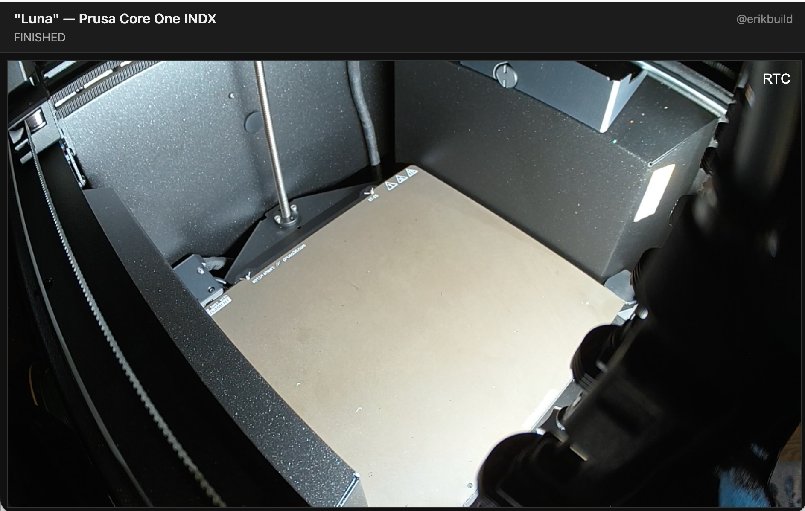

# Printer Streamer

Shows the RTSP camera feed from a 3D Printer on a single-pane webpage, with a live job-status line fed by PrusaLink. Originally designed for Prusa 3D Printers with a Buddy Cam and PrusaLink available locally.

Runs as a small Docker Compose stack on a local/home server. Viewable on the LAN and, through a Cloudflare Tunnel with Cloudflare Access in front, from anywhere.



## Stack

| Service | Image | Purpose |
|---|---|---|
| `go2rtc` | `alexxit/go2rtc` | Pulls the printer's RTSP feed, re-encodes it into clean H.264 (the Buddy Camc's own stream can be glitchy — see Troubleshooting), serves WebRTC / MSE / HLS |
| `web` | `nginx:alpine` | Serves the page; reverse-proxies go2rtc under `/go2rtc/` and relays read-only PrusaLink stats under `/printer/` |
| `cloudflared` | `cloudflare/cloudflared` | Optional (`--profile tunnel`): outbound tunnel to Cloudflare |

The same-origin proxy matters: Cloudflare Tunnel maps one hostname to one
service+port and only carries HTTP/WebSocket. Because the page uses relative
`/go2rtc/` URLs, the identical page works on the LAN and through the tunnel.

## How the video plays

The page embeds go2rtc's player with `mode=webrtc,mse,hls`:

- **LAN:** WebRTC direct to port 8555 (sub-second latency). Requires
  `WEBRTC_HOST_IP` set to this machine's LAN IP.
- **Through the tunnel:** WebRTC can't traverse Cloudflare Tunnel, so the
  player falls back to MSE over WebSocket automatically.
- **iOS Safari:** falls back to HLS.

If `WEBRTC_HOST_IP` is unset or wrong, everything still works via MSE.

## Printer stats

The header's second line shows the current job (filename — % — time left,
or the printer's state when idle), fetched from PrusaLink every 60 seconds
via a GET-only nginx relay (`/printer/status`, `/printer/job`). Only those
two read-only endpoints are exposed.

## Setup on the server

Prerequisites: Docker with the compose plugin, `make`, and LAN access to the
printer.

1. Get the repo onto the server:

   ```sh
   git clone git@github.com:erikbuild/printer-streamer.git
   cd printer-streamer
   ```

2. Configure:

   ```sh
   cp .env.example .env
   $EDITOR .env
   ```

   - `WEBRTC_HOST_IP` — the server's LAN IP (required for WebRTC's low-latency path; everything still works via MSE without it)
   - `WEB_PORT` — change if 8080 is taken on the server
   - `CAMERA_RTSP_URL` — only if the printer's address changes
   - `PRUSALINK_HOST` / `PRUSALINK_API_KEY` — for the header stats line;
     both are in the printer's Settings → Network → PrusaLink

3. Start and verify on the LAN:

   ```sh
   make up
   ```

   Open `http://<server-ip>:8080/` (or your `WEB_PORT`) — live video should play. `make logs` if it doesn't.

4. For internet access, set up the tunnel and Access policy — see
   [Cloudflare Tunnel](#cloudflare-tunnel) and
   [Cloudflare Access](#cloudflare-access) below — then:

   ```sh
   make tunnel-up
   ```

The stack restarts itself (`restart: unless-stopped`), including after a
server reboot, as long as the Docker daemon starts on boot.

## Configuration (`.env`)

| Variable | Default | Purpose |
|---|---|---|
| `CAMERA_RTSP_URL` | `rtsp://192.168.1.233/live` | Printer camera RTSP URL |
| `WEB_PORT` | `8080` | Host port for the webpage |
| `WEBRTC_HOST_IP` | `127.0.0.1` | LAN IP of this machine, advertised as the WebRTC candidate |
| `CF_TUNNEL_TOKEN` | — | Cloudflare Tunnel token (only for `make tunnel-up`) |
| `PRUSALINK_HOST` | `127.0.0.1:9` (off) | LAN address of PrusaLink, for the header stats line |
| `PRUSALINK_API_KEY` | — | PrusaLink API key; injected server-side, never sent to browsers |

## Cloudflare Tunnel

Cloudflare Tunnel (`cloudflared`) makes an outbound connection from the
server to Cloudflare's edge and serves the page at a public HTTPS URL — no
open ports, no reverse proxy, no static IP. Free with a Cloudflare account.

Prerequisites: a domain on Cloudflare (the zone just has to exist there) and
access to the Zero Trust dashboard (free tier).

1. **Create the tunnel.** Zero Trust dashboard → **Networks → Tunnels →
   Create a tunnel**:
   - Connector type: **Cloudflared**
   - Name: anything (e.g. `printer-streamer`)
   - Save → you get a **tunnel token** (long base64 string starting with
     `eyJ...`). Paste it into `CF_TUNNEL_TOKEN` in `.env`.

2. **Add a public hostname.** Same screen → **Public Hostname** tab →
   **Add a public hostname**:
   - Subdomain/domain: whatever the page should live at
   - Path: leave blank
   - Service: type `HTTP`, URL `web:80` (the compose service name and
     container port — cloudflared reaches it over the compose network)

   Cloudflare auto-creates the DNS record pointed at the tunnel.

3. **Protect it with Access** — see [Cloudflare Access](#cloudflare-access)
   below. **Do this — the page has no auth of its own.**

4. **Start it:**

   ```sh
   make tunnel-up
   make logs      # look for "Registered tunnel connection"
   ```

   Then open the public hostname — the page loads over HTTPS.

To stop exposing the page, `make tunnel-down` — the LAN page keeps running,
and the Cloudflare side stays configured for the next `make tunnel-up`. To
remove it entirely, also delete the tunnel and public hostname in the Zero
Trust dashboard.

## Cloudflare Access

If you want to restrict access, Cloudflare Access is an easy way to do so (free for up to 50 users currently?)

1. Zero Trust dashboard → **Access → Applications → Add an application →
   Self-hosted**
2. Set the app's domain to the tunnel's public hostname (the same
   subdomain/domain from the tunnel setup)
3. Identity: enable **One-time PIN** — viewers enter their email, receive a
   code, done; no passwords stored anywhere. Google/GitHub login can be
   added later if preferred.
4. Policy: `Action: Allow`, `Include: Emails` → list the addresses allowed
   to watch
5. Set a comfortable session duration (24 h – 1 week) to avoid constant
   re-authing

## Day-to-day Usage

| Command | What it does |
|---|---|
| `make up` / `make down` | Start / stop the stack |
| `make tunnel-up` / `make tunnel-down` | Start everything incl. tunnel / stop just the tunnel |
| `make restart` | Restart services (e.g. after config edits) |
| `make logs` | Tail logs |
| `make ps` / `make stats` | Status / resource usage |
| `make check` | Validate compose + nginx config |
| `make test` | End-to-end test against a synthetic RTSP camera |

## Troubleshooting

- **"Video can't be played because the file is corrupt" (MSE viewers):** the
  camera's embedded RTSP server drops RTP data at the source (even over TCP),
  producing a corrupt H.264 bitstream — roughly 15 bad frames/minute at 720p,
  far worse at 1080p or with multiple direct RTSP clients. WebRTC conceals
  the damage; MSE treats it as fatal. That's why the stream line in
  `go2rtc/go2rtc.yaml` has the `ffmpeg:` re-encode prefix — if this error
  appears, check the prefix is still there. Keep the camera at 720p (its
  design point) and avoid pointing extra RTSP clients at it; go2rtc keeps a
  single camera session shared by all viewers.
- **Header says "printer stats unavailable":** `PRUSALINK_HOST` /
  `PRUSALINK_API_KEY` unset or wrong in `.env`, or PrusaLink is unreachable.
  Verify with `curl -H "X-Api-Key: <key>" http://<printer-ip>/api/v1/status`
  from the host, then `make restart`.

## Future Enhancements?
- Moonraker stats for Klipper/Kalico based printers.
- Other input stream types?